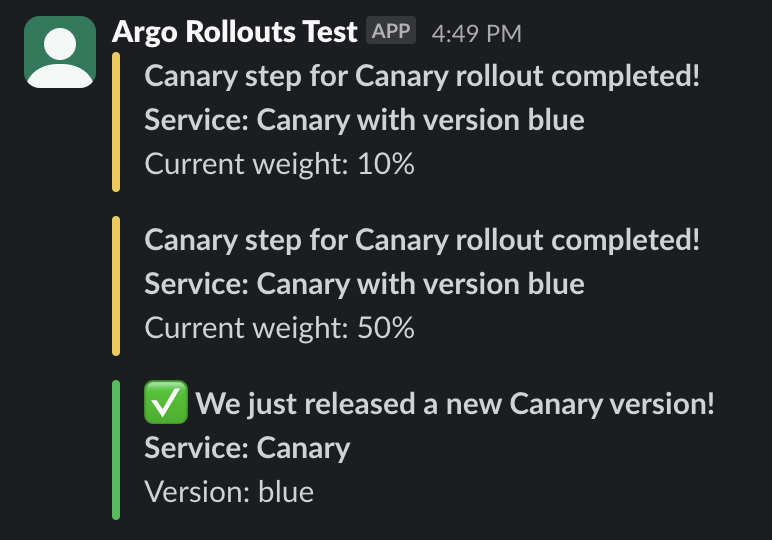

# Argo Rollouts Canary Notifications demo

Enabling `slack` notifications for Argo Rollouts

## Requirements

- Everything from repository root completed (except cleanup obviously)

## Steps

### Prepare manifests

In order for controller to work and recognize what for and where to send notifications, two manifests need some configuration:
- `rollouts.yaml` - under annotations change `channel-name` value to match your Slack notification channel name
- `Values.yaml` - change `slack-token` value to your slack token (see [more here](https://argoproj.github.io/argo-rollouts/generated/notification-services/slack/#configuration) on how to create one)

### Configuring notifications

To configure notifications on controller level run:
```bash
helm upgrade --values Values.yaml argo-rollouts argo/argo-rollouts -n argo-rollouts
```
This will enable notifications by adding required ConfigMap and Secret for controller to use. ConfigMap consists of notification templates and triggers, while Secret Slack token.

### Enable notifications

To enable notifications, `Rollout` object needs to have annotations, ie.
```yaml
notifications.argoproj.io/subscribe.on-rollout-completed.slack: "channel-name" 
```
where
- `notifications.argoproj.io/subscribe` is default part for controller to recognizes notifications
- `on-rollout-completed` - defines which trigger to use (defined in ConfigMap set earlier)
- `slack` - defines where notifications are sent
- `"channel-name"` - defines Slack channel name

To easy apply this on existing `Rollout` object run
```bash
kubectl apply -f rollout.yaml
```
With this notifications should be enabled, and on each promote, abort and rollout completion, Slack notification should arrive.

<p align="center">

</p>